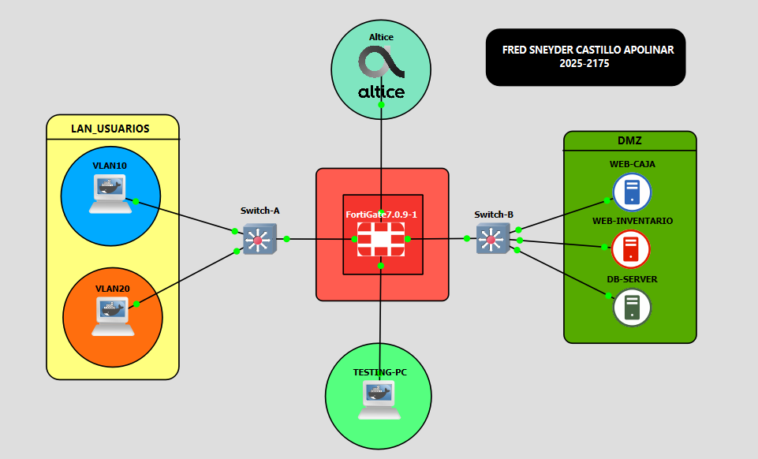
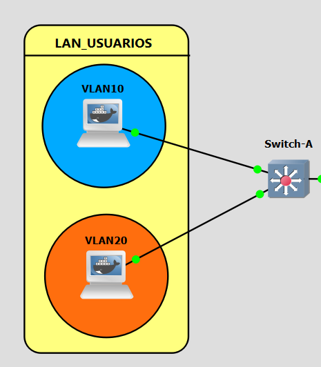
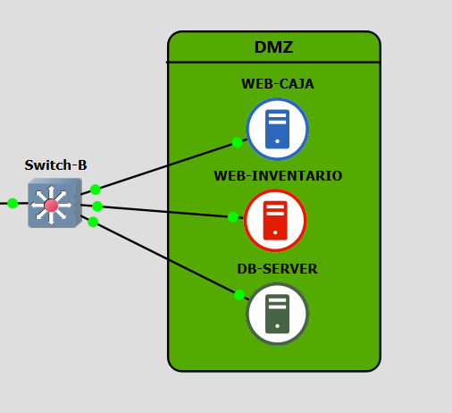

<h1 align="center">🛡️ Laboratorio de Seguridad DMZ con FortiGate</h1>

<p align="center">
  <a href="https://github.com/fredcastillo/fortigate-dmz-security-lab"></a>
  <a href="https://github.com/fredcastillo/fortigate-dmz-security-lab"></a>
  <a href="https://github.com/fredcastillo/fortigate-dmz-security-lab"></a>
  <a href="https://github.com/fredcastillo/fortigate-dmz-security-lab"></a>
  <a href="https://github.com/fredcastillo/fortigate-dmz-security-lab"></a>
  <a href="https://github.com/fredcastillo/fortigate-dmz-security-lab"></a>
  <a href="https://github.com/fredcastillo/fortigate-dmz-security-lab"></a>
</p>

> **Autor:** Fred Sneyder Castillo Apolinar  \ **Matrícula:** 2025-2175  \ **Programa:** Tecnólogo en Seguridad Informática — ITLA  \ **Plataforma:** GNS3 + GNS3 VM + FortiGate-VM64-KVM  \ **FortiOS:** 7.0.9 build 0444

> ## 🎥 Video demostrativo
<div align="center">
  <a href="https://www.youtube.com/watch?v=iKMu1Q_3kfY">
    
  </a>
  <br>
  <strong>▶ Haz clic para ver el video</strong>
</div>

---

## 1. Propósito

Este laboratorio implementa una arquitectura segmentada de seguridad de redes en GNS3. El FortiGate funciona como punto central de control para separar usuarios y servidores, aplicar políticas de mínimo privilegio y demostrar controles de acceso mediante pruebas positivas y negativas.

La práctica cubre:

- segmentación de usuarios y servidores mediante VLANs y DMZ;
- DHCP para las redes de usuarios;
- tres servidores con funciones diferenciadas: Caja, Inventario y Base de Datos;
- políticas que controlan explícitamente los servicios permitidos entre segmentos;
- SSH autorizado desde VLAN 20 y bloqueado desde VLAN 10;
- bloqueo de VLAN 10 hacia el Sistema de Inventario;
- salida de actualización de la DMZ restringida a endpoints definidos;
- bloqueo de Internet HTTPS arbitrario desde la DMZ;
- seguridad básica de switches mediante controles de capa 2;
- documentación profesional, evidencias, scripts y running-configs.

---

## 2. Cumplimiento de la asignación

| Requisito | Estado | Evidencia / referencia |
|---|---|---|
| FortiGate | ✅ | `04`, `06` |
| Configuración funcional del FortiGate por GUI | ✅ | `04`, `05`, `06`, `07`, `08` |
| Servidores en DMZ | ✅ | `03`, `10` |
| Políticas contra fuga de tráfico hacia LAN | ✅ | `06` |
| DMZ sin Internet abierto | ✅ | `18` |
| Solo endpoints de actualización autorizados | ✅ configuración / ✅ validación en DB-SERVER | `07`, `17` |
| VLAN 20 como red autorizada para SSH | ✅ | `13` y `14` |
| VLAN 10 bloqueada contra Sistema de Inventario | ✅ | `16` |
| Violación de política visible para el usuario | ✅ | `16` |
| Dos switches | ✅ | `09`, `10` |
| VLAN + seguridad básica | ✅ | `09`, `10` |
| WEB-CAJA | ✅ | `15` |
| WEB-INVENTARIO | ✅ | `16` |
| DB-SERVER | ✅ | `13`, `17` |
| DHCP | ✅ | `05`, `11` |
| Documentación profesional | ✅ | `docs/` |
| Imágenes | ✅ preparadas para insertar | `images/` |
| Diagramas | ✅ | `diagrams/` |
| Scripts | ✅ | `scripts/` |
| Running-configs | ✅ estructura preparada | `configs/running-configs/` |
| Video al principio del repositorio | ✅ enlace desde README | `video/VIDEO.md` |

---

## 3. Arquitectura



La explicación completa de la topología, direccionamiento y flujos está en [`docs/02-topologia-y-direccionamiento.md`](docs/02-topologia-y-direccionamiento.md).

Diagramas editables:

- [`diagrams/topology.mmd`](diagrams/topology.mmd)
- [`diagrams/traffic-flows.mmd`](diagrams/traffic-flows.mmd)

---

## 4. Evidencias visuales

La documentación utiliza referencias Markdown reales. Cuando coloques los 18 PNG en `images/`, distribuidos en cuatro carpetas con los nombres acordados, GitHub los renderizará automáticamente dentro de los documentos.

Índice visual completo: [`docs/06-evidencias.md`](docs/06-evidencias.md).

### Evidencias de arquitectura





### Evidencias de configuración


### Evidencias funcionales


---

## 5. Direccionamiento de trabajo

| Segmento / equipo | Dirección | Función |
|---|---|---|
| VLAN 10 | `10.21.75.0/25` | Usuarios |
| Gateway VLAN 10 | `10.21.75.1` | Gateway / DHCP |
| VLAN 20 — cliente observado | `20.21.75.141` | Browser-PC |
| Gateway observado VLAN 20 | `20.21.75.129` | Gateway / DHCP |
| WEB-CAJA | `20.21.75.130/28` | Sistema de Caja |
| WEB-INVENTARIO | `20.21.75.131/28` | Sistema de Inventario |
| DB-SERVER | `20.21.75.132/28` | Base de Datos |

Los valores se documentan según las pruebas realizadas. Para una auditoría posterior, las capturas de FortiGate son la referencia primaria de la configuración de interfaces y DHCP.

---

## 6. Políticas de seguridad demostradas

**VLAN 10 → WEB-CAJA:** permitido para el servicio web requerido. Evidencia: `15-test-vlan10-web-caja-allowed.png`.

**VLAN 10 → WEB-INVENTARIO:** bloqueado. Evidencia: `16-test-vlan10-web-inventario-blocked.png`.

**VLAN 20 → SSH:** autorizado. Evidencia final: `13-test-vlan20-ssh-allowed.png`.

**VLAN 10 → SSH:** bloqueado. Evidencia: `14-test-vlan10-ssh-blocked.png`.

**DMZ → endpoints de actualización:** permitido según la política definida. Evidencia: `17-test-dmz-ubuntu-updates-allowed.png`.

**DMZ → Internet HTTPS arbitrario:** bloqueado. Evidencia: `18-test-dmz-internet-blocked.png`.

---

## 7. Scripts y configuraciones

### Scripts

- `scripts/setup-browser-pc.sh` — DHCP/DNS y validación opcional de VLAN.
- `scripts/install-ssh-client.sh` — instalación del cliente OpenSSH.
- `scripts/configure-ssh-server.sh` — preparación de OpenSSH Server para laboratorio.
- `scripts/test-dmz-internet-block.sh` — prueba de bloqueo HTTPS arbitrario usando `nc`.
- `scripts/check-evidence.sh` — valida las 18 imágenes requeridas.

### Configuraciones

La carpeta `configs/` está destinada a guardar las salidas finales reales de los equipos. No se reconstruyen running-configs ficticios a partir de memoria o de otra práctica.

---

## 8. Credenciales de laboratorio

```text
Usuario SSH:     labssh
Contraseña:      LabSSH123!
```

Son credenciales deliberadamente académicas. **No deben utilizarse en producción, en sistemas reales o en servicios expuestos a Internet.**

Detalle: [`docs/09-credenciales-lab.md`](docs/09-credenciales-lab.md).

---

## 9. Estructura del repositorio

```text
.
├── README.md
├── README-EN.md
├── .gitignore
├── docs/                  # Solo documentación Markdown
│   ├── 00-indice-entrega.md
│   ├── 01-proposito-y-alcance.md
│   ├── 02-topologia-y-direccionamiento.md
│   ├── 03-fortigate-y-politicas.md
│   ├── 04-switches-y-seguridad.md
│   ├── 05-servidores-y-servicios.md
│   ├── 06-evidencias.md
│   ├── 07-checklist-requisitos.md
│   ├── 08-guion-video.md
│   └── 09-credenciales-lab.md
├── images/                # Las 18 capturas PNG, distribuidas en cuatro carpetas
├── diagrams/              # Fuentes Mermaid editables
├── configs/               # Configuración y running-configs
├── scripts/               # Scripts utilizados
└── video/                 # Material y enlace del video
```

> **Importante:** las imágenes NO están dentro de `docs/`. Todos los enlaces desde `docs/*.md` usan `../images/<archivo>.png`.

---

## 10. Validación de evidencias

Cuando hayas colocado las 18 capturas, ejecuta desde la raíz:

```bash
chmod +x scripts/check-evidence.sh
./scripts/check-evidence.sh
```

El resultado esperado es:

```text
[OK] Las 18 evidencias están presentes.
```

---

## 11. Documentación

- [`docs/00-indice-entrega.md`](docs/00-indice-entrega.md)
- [`docs/01-proposito-y-alcance.md`](docs/01-proposito-y-alcance.md)
- [`docs/02-topologia-y-direccionamiento.md`](docs/02-topologia-y-direccionamiento.md)
- [`docs/03-fortigate-y-politicas.md`](docs/03-fortigate-y-politicas.md)
- [`docs/04-switches-y-seguridad.md`](docs/04-switches-y-seguridad.md)
- [`docs/05-servidores-y-servicios.md`](docs/05-servidores-y-servicios.md)
- [`docs/06-evidencias.md`](docs/06-evidencias.md)
- [`docs/07-checklist-requisitos.md`](docs/07-checklist-requisitos.md)
- [`docs/09-credenciales-lab.md`](docs/09-credenciales-lab.md)

---

## 👨‍💻 Autor

**Fred Castillo**  
*Estudiante de Tecnólogo en Seguridad Informática* 

[](https://www.linkedin.com/in/fredcastillo11/)
[](https://github.com/fredcastillo)

---

