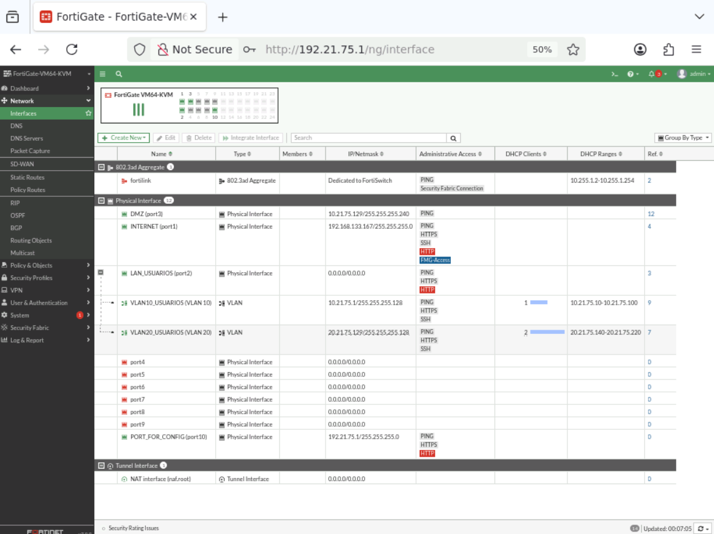

# 1. Propósito y alcance

## Propósito

Implementar y documentar una infraestructura de red segmentada en GNS3 donde FortiGate controle los flujos entre usuarios y servidores, reduciendo superficie de exposición mediante políticas explícitas.

## Objetivos

- Separar usuarios de servidores mediante un segmento de DMZ.
- Proporcionar DHCP a los segmentos de usuarios.
- Mantener separados los servicios de Caja, Inventario y Base de Datos.
- Permitir únicamente los servicios necesarios entre segmentos.
- Hacer que VLAN 20 sea la red autorizada para SSH.
- Impedir que VLAN 10 acceda al Sistema de Inventario.
- Permitir las actualizaciones definidas para la DMZ sin ofrecer salida abierta a Internet.
- Aplicar controles básicos de seguridad en los switches.
- Generar evidencia visual y técnica reproducible.

## Alcance técnico

El trabajo se centra en:

- GNS3/GNS3 VM.
- FortiGate-VM64-KVM con FortiOS 7.0.9 build 0444.
- Dos switches de acceso.
- Tres servidores Linux.
- Dos segmentos de usuarios.
- DHCP, DNS, HTTPS y SSH de laboratorio.
- Políticas de firewall y pruebas de acceso positivo/negativo.

## Método de administración

La consigna exige que la configuración y demostración funcional del FortiGate se realice mediante GUI. Por ello, la documentación presenta la GUI como método principal. CLI en FortiGate se limita a bootstrap, comprobaciones o diagnóstico cuando correspondió.

La evidencia visual de las interfaces se complementa con la evidencia de políticas en `../images/02-fortigate/06-fortigate-firewall-policies.png`.

## Resultado esperado

El resultado no es únicamente conectividad. La infraestructura debe mostrar que los flujos permitidos funcionan y que los flujos restringidos son realmente bloqueados.
