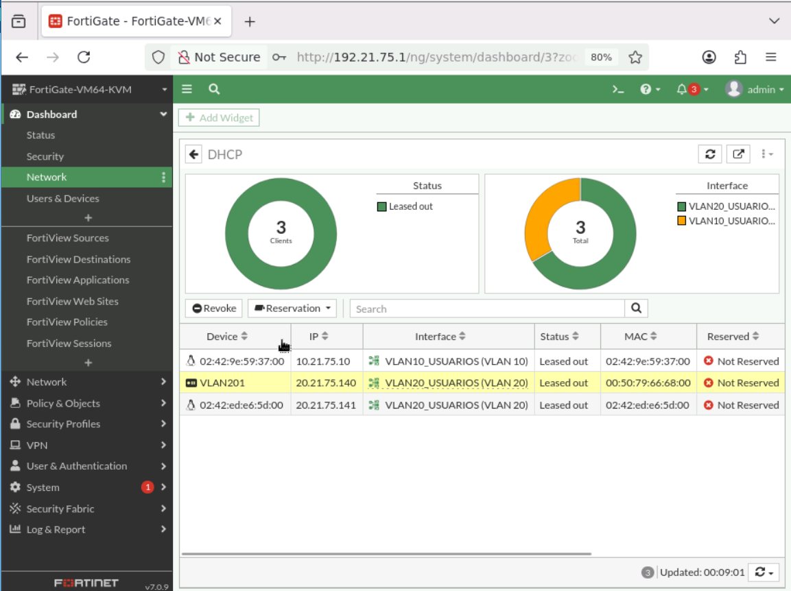
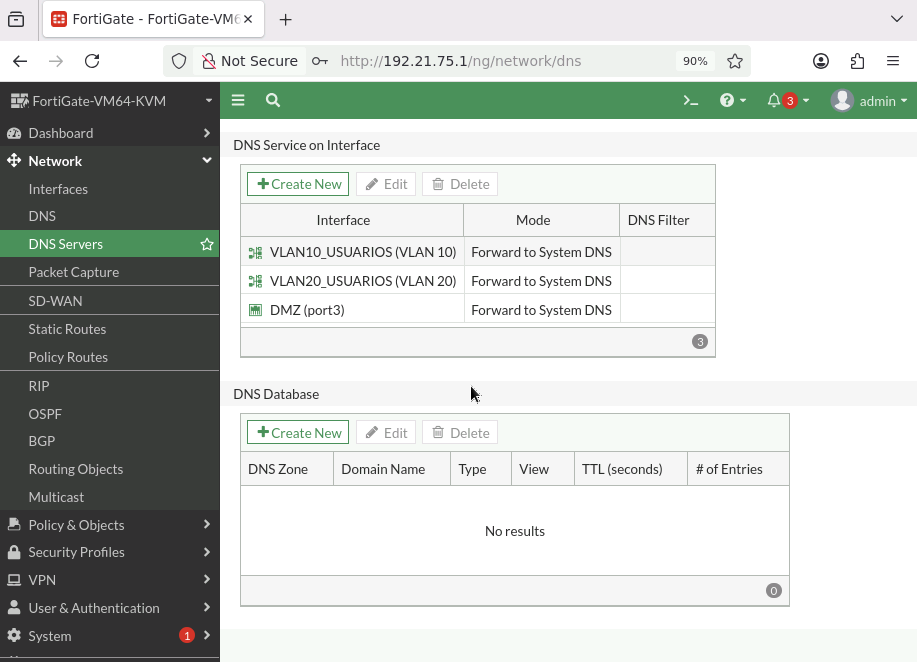
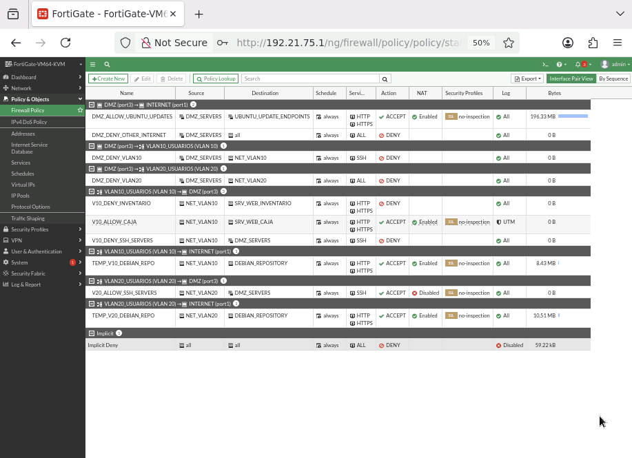
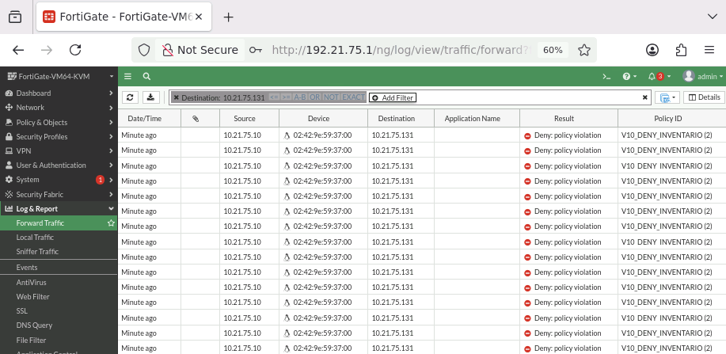
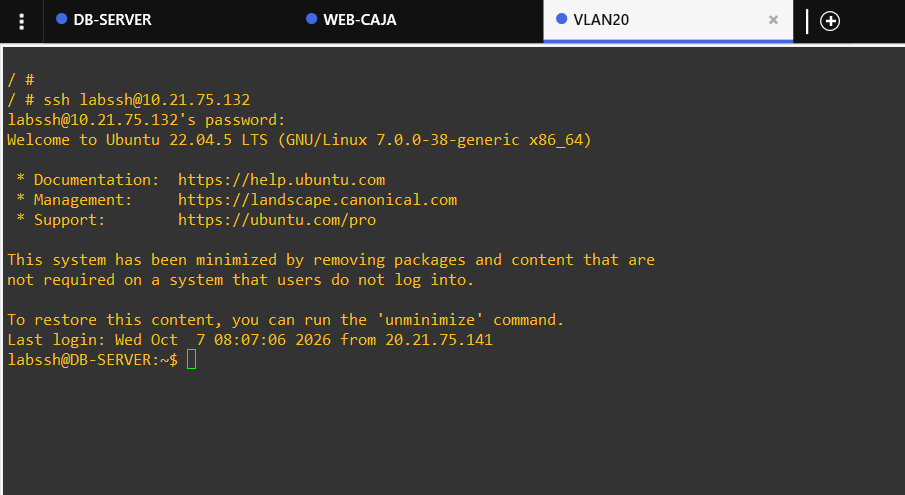
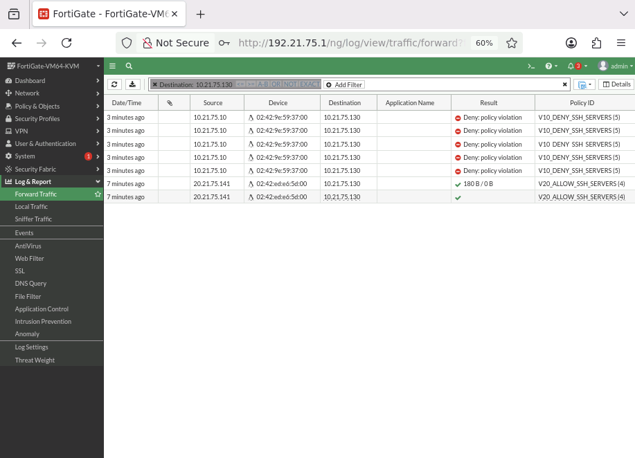
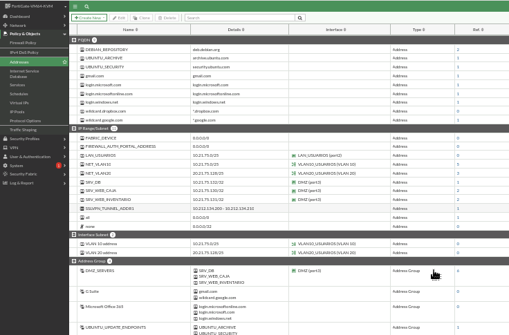
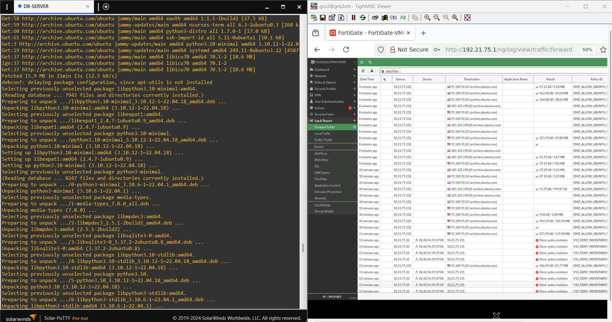
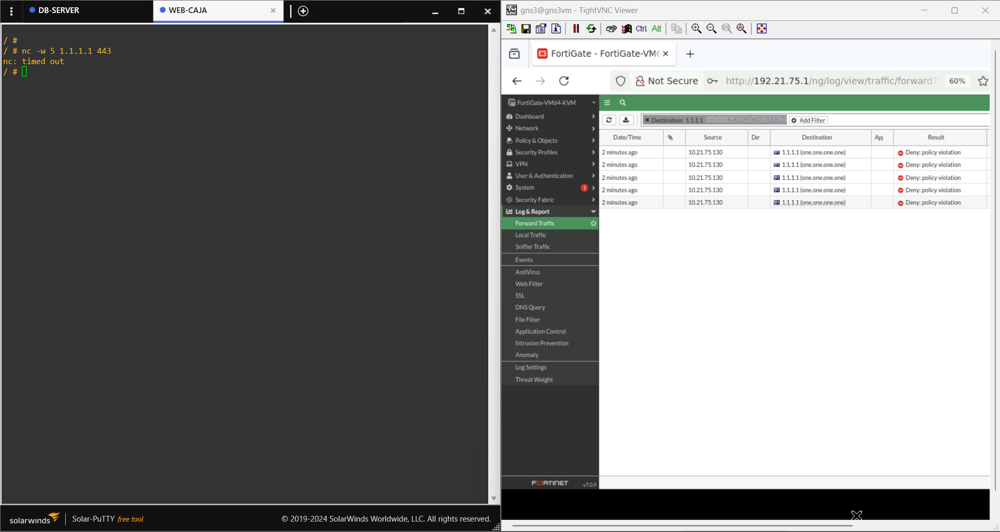

# 3. FortiGate y políticas

## Interfaces

## DHCP

La configuración DHCP se utiliza para entregar direccionamiento a los clientes de las redes de usuarios.

## DNS

La resolución de nombres se utilizó para validar la conectividad necesaria para pruebas y actualizaciones.

## Políticas de firewall

La política del FortiGate se organiza alrededor del principio de mínimo privilegio: cada flujo requerido se permite explícitamente y los flujos que no corresponden a la función del segmento se bloquean.

### VLAN 10 → WEB-CAJA

Permite el acceso web al Sistema de Caja.

Evidencia funcional: `../images/04-tests/15-test-vlan10-web-caja-allowed.png`.

### VLAN 10 → WEB-INVENTARIO

El acceso al Sistema de Inventario debe ser bloqueado para VLAN 10.

La captura anterior es la evidencia principal de la violación de política observada por el usuario.

### VLAN 20 → SSH

SSH se autoriza desde VLAN 20. La prueba funcional final se realizó contra DB-SERVER `20.21.75.132`.

### VLAN 10 → SSH

El intento desde VLAN 10 debe quedar rechazado.

### DMZ → endpoints de actualización

Se definieron objetos de dirección/FQDN y una política específica para permitir únicamente la actualización necesaria.

La actualización fue validada en DB-SERVER.

### DMZ → Internet arbitrario

La DMZ no dispone de salida HTTPS abierta hacia destinos externos no autorizados.

