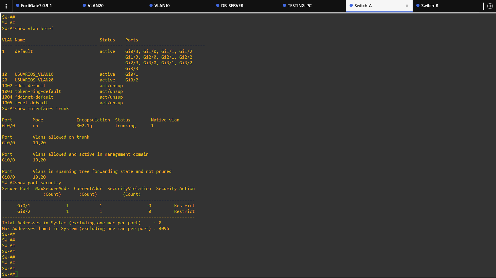
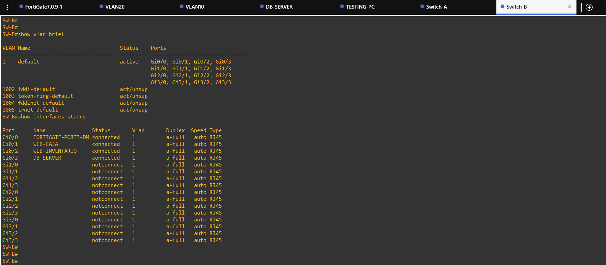

# 4. Switches y seguridad básica

## SW-A — usuarios

SW-A concentra las conexiones de los usuarios y transporta las VLAN requeridas para las pruebas.

Controles documentados:

- VLAN 10.
- VLAN 20.
- enlace de interconexión con el FortiGate.
- puertos de acceso de usuarios.
- port-security con sticky MAC.
- límite de una MAC en los puertos donde se definió.
- `violation restrict`.
- PortFast/edge.
- BPDU Guard.

## SW-B — DMZ

SW-B conecta los tres servidores del segmento DMZ:

- WEB-CAJA — `20.21.75.130`.
- WEB-INVENTARIO — `20.21.75.131`.
- DB-SERVER — `20.21.75.132`.

## Evidencia de la segmentación

La arquitectura física/lógica se aprecia también en `../images/01-topologia/02-topologia-lan-vlans.png` y `../images/01-topologia/03-topologia-dmz-servidores.png`.
