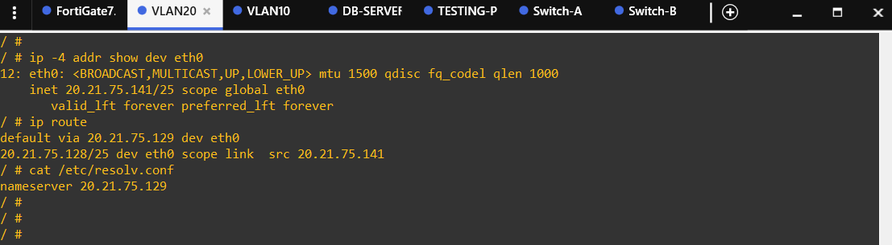
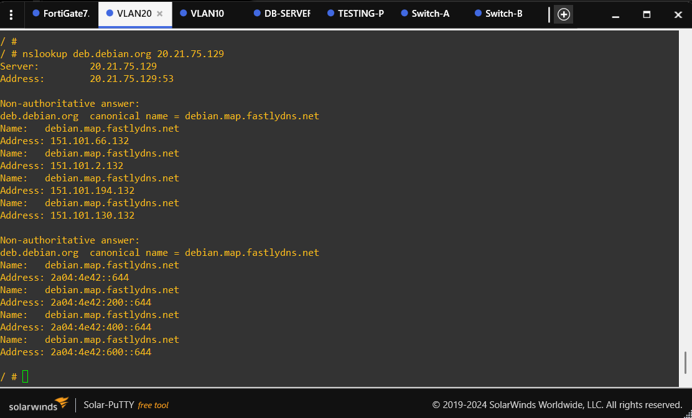
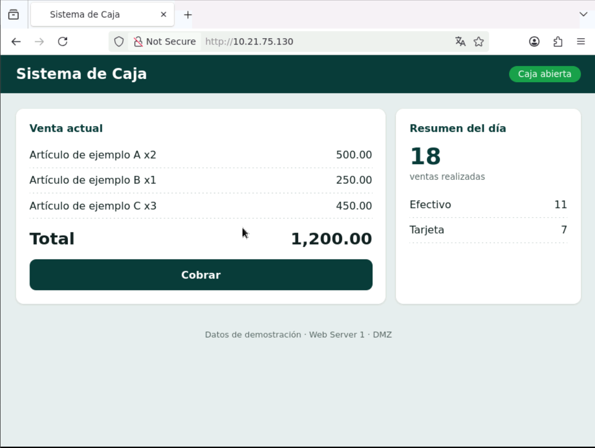

# 6. Evidencias del laboratorio

> Las imágenes se almacenan fuera de `docs/`, en `../images/`. Los enlaces siguientes están preparados para GitHub y se renderizarán automáticamente cuando coloques los PNG con estos nombres exactos.

## 01 — Topología general del laboratorio en GNS3

**Archivo:** `01-topologia-general.png`  
**Qué demuestra:** Vista completa de FortiGate, switches, VLANs y servidores.

## 02 — Segmentación LAN y VLANs

**Archivo:** `02-topologia-lan-vlans.png`  
**Qué demuestra:** Separación visual de VLAN 10 y VLAN 20 y su conexión con el FortiGate.

## 03 — DMZ y servidores

**Archivo:** `03-topologia-dmz-servidores.png`  
**Qué demuestra:** Ubicación de WEB-CAJA, WEB-INVENTARIO y DB-SERVER en el segmento de servidores.

## 04 — Interfaces del FortiGate

**Archivo:** `04-fortigate-interfaces.png`  
**Qué demuestra:** Interfaces, direccionamiento y rol de los segmentos configurados en el firewall.

## 05 — DHCP de las VLAN

**Archivo:** `05-fortigate-dhcp-vlans.png`  
**Qué demuestra:** Configuración de DHCP utilizada para los segmentos de usuarios.

## 06 — Políticas de firewall

**Archivo:** `06-fortigate-firewall-policies.png`  
**Qué demuestra:** Políticas que controlan los flujos entre usuarios, DMZ y servicios.

## 07 — Endpoints de actualización

**Archivo:** `07-fortigate-update-addresses.png`  
**Qué demuestra:** Objetos/FQDN utilizados para permitir las actualizaciones necesarias de la DMZ.

## 08 — DNS del FortiGate

**Archivo:** `08-fortigate-dns.png`  
**Qué demuestra:** Configuración DNS/resolución empleada durante la práctica.

## 09 — SW-A: VLAN y seguridad básica

**Archivo:** `09-sw-a-vlans-security.png`  
**Qué demuestra:** VLANs de usuarios y controles de capa 2 como port-security y protección STP.

## 10 — SW-B: DMZ

**Archivo:** `10-sw-b-dmz.png`  
**Qué demuestra:** Puertos de acceso de los tres servidores y la VLAN de DMZ.

## 11 — VLAN 20: DHCP y DNS

**Archivo:** `11-test-vlan20-dhcp-dns.png`  
**Qué demuestra:** Obtención de IP por DHCP, gateway y preparación inicial del cliente.

## 12 — VLAN 20: resolución DNS

**Archivo:** `12-test-vlan20-dns-resolution.png`  
**Qué demuestra:** Resolución funcional de nombres desde el Browser-PC de VLAN 20.

## 13 — VLAN 20: SSH permitido

**Archivo:** `13-test-vlan20-ssh-allowed.png`  
**Qué demuestra:** Sesión SSH autenticada desde VLAN 20 hacia DB-SERVER 20.21.75.132.

## 14 — VLAN 10: SSH bloqueado

**Archivo:** `14-test-vlan10-ssh-blocked.png`  
**Qué demuestra:** Intento de SSH desde VLAN 10 rechazado por la política de seguridad.

## 15 — VLAN 10: Sistema de Caja permitido

**Archivo:** `15-test-vlan10-web-caja-allowed.png`  
**Qué demuestra:** Acceso web autorizado al servidor de Caja desde VLAN 10.

## 16 — VLAN 10: Sistema de Inventario bloqueado

**Archivo:** `16-test-vlan10-web-inventario-blocked.png`  
**Qué demuestra:** Intento de acceso al Sistema de Inventario bloqueado; evidencia visible de la violación de política.

## 17 — DMZ: actualización permitida

**Archivo:** `17-test-dmz-ubuntu-updates-allowed.png`  
**Qué demuestra:** Actualización validada en DB-SERVER mediante los endpoints autorizados.

## 18 — DMZ: Internet arbitrario bloqueado

**Archivo:** `18-test-dmz-internet-blocked.png`  
**Qué demuestra:** Intento HTTPS hacia Internet externo no autorizado que no establece conexión.

## Orden de revisión

1. Arquitectura — evidencias 01–03.
2. FortiGate — evidencias 04–08.
3. Switches — evidencias 09–10.
4. Preparación de VLAN 20 — evidencias 11–12.
5. Control de acceso — evidencias 13–16.
6. Salida de DMZ — evidencias 17–18.
